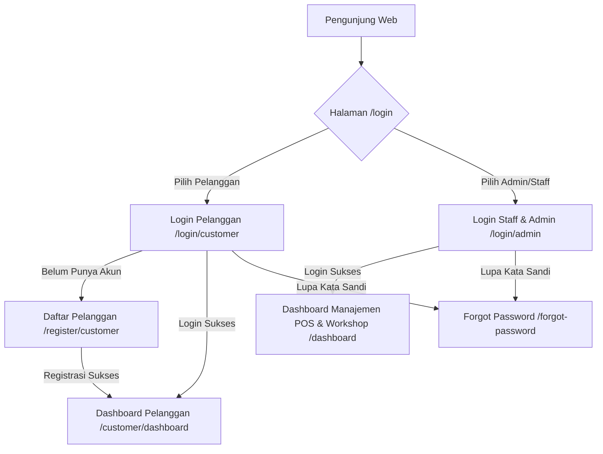
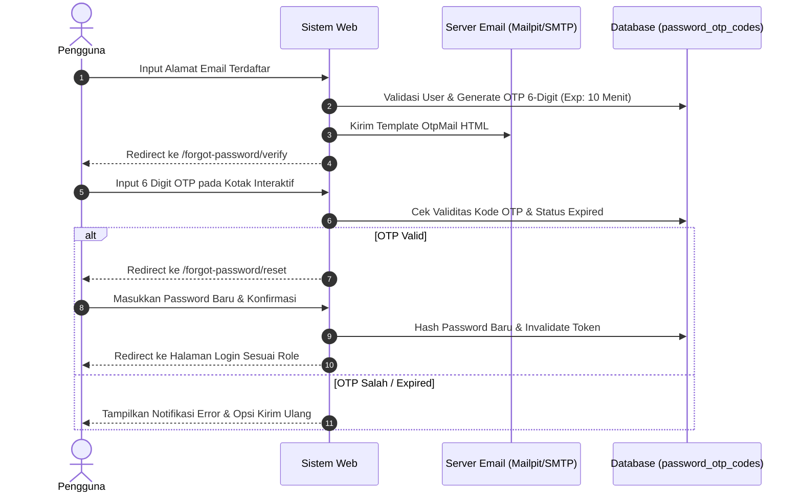
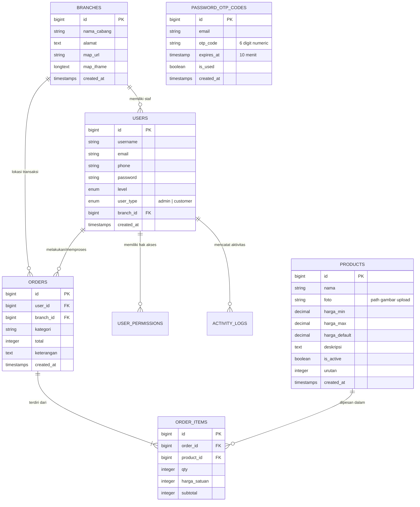

# 🎨 Kaligraph Design — Architecture & UI/UX Design System Specification

---

## 1. Filosofi & Konsep Desain

**Kaligraph Design** mengusung tema **"Electric Neon & Modern Signage Aesthetics"**. 

Sistem desain ini dirancang untuk mencerminkan karakteristik industri pembuatan *neon box, huruf timbul, dan signage reklame*:
* **Luminous & Vibrant**: Efek pencahayaan LED neon terang, gradasi biru elektrik (*electric blue*) ke ungu ultraviolet (*indigo/violet*), serta aksen kuning neon (*amber glow*).
* **Atmospheric Contrast**: Kontras tinggi antara latar belakang gelap elegan dengan elemen cahaya menyala untuk menghadirkan visual papan nama neon di malam hari.
* **Clarity & Functionality**: Informasi produk esensial (spesifikasi bahan, foto produk nyata, rentang harga, lokasi showroom dengan Google Maps embed) disajikan secara jelas, terstruktur, dan ramah pengguna (*user-centric*).

---

## 2. Color Palette & Design Tokens

### Primary & Accent Colors

| Token Name | Hex Code | Preview | Penggunaan Utama |
| :--- | :--- | :---: | :--- |
| `--primary` | `#2563EB` | 🟦 | Tombol utama, link aktif, highlight teks |
| `--primary-hover` | `#1D4ED8` | 🟦 | State hover pada tombol primer |
| `--primary-light` | `#DBEAFE` | 🩵 | Background badge, icon container ringan |
| `--accent-violet` | `#7C3AED` | 🟪 | Gradient hero, icon header, portal admin |
| `--accent-neon-amber` | `#EAB308` | 🟨 | Badge "Terlaris", alert peringatan, neon glow |
| `--success-green` | `#10B981` | 🟩 | Status selesai, badge aktif, WhatsApp CTA |
| `--danger-red` | `#EF4444` | 🟥 | Tombol hapus, status error, countdown warning |

### Neutral & Theme Palettes

```css
:root {
  /* Light Mode */
  --bg-main: #f0f4ff;
  --bg-card: #ffffff;
  --bg-sidebar: #0f172a;
  --text-main: #0d1b3e;
  --text-muted: #5a6a8a;
  --border-color: #dde4f0;
  --radius-sm: 8px;
  --radius-md: 12px;
  --radius-lg: 20px;
  --radius-xl: 24px;
}

[data-theme="dark"] {
  /* Dark Neon Mode */
  --bg-main: #060d1f;
  --bg-card: #111827;
  --bg-sidebar: #020617;
  --text-main: #f8fafc;
  --text-muted: #94a3b8;
  --border-color: #1e2d4a;
}
```

---

## 3. Sistem Tipografi

* **Primary Font Family**: `'Plus Jakarta Sans', -apple-system, BlinkMacSystemFont, 'Segoe UI', sans-serif`
* **Karakteristik**: Geometris, modern, keterbacaan tinggi di berbagai ukuran layar.

### Skala Tipografi (Type Scale)

| Level | Size | Weight | Line Height | Contoh Penggunaan |
| :--- | :--- | :--- | :--- | :--- |
| **Hero Display** | `58px` | `800 (Extra Bold)` | `1.1` | Headline Utama Landing Page |
| **Section Title** | `36px` | `800 (Extra Bold)` | `1.2` | Judul Bagian Katalog & Keunggulan |
| **Card Heading** | `22px` - `24px` | `800 (Bold)` | `1.3` | Judul Kartu Portal & Nama Modal |
| **Body Regular** | `14px` - `15px` | `400 / 500` | `1.6` | Paragraf penjelasan & deskripsi produk |
| **Caption & Badges** | `11px` - `12px` | `700 (Bold)` | `1.4` | Badge status, kategori, metadata |

---

## 4. Arsitektur Komponen UI

### A. Landing Page Component Hierarchy
1. **Glassmorphism Sticky Navbar**:
   - Logo bercahaya `💡 Kaligraph Design`.
   - Navigasi mulus (*smooth scroll*).
   - Akses ganda: tombol *🛍️ Portal Pelanggan* dan *Masuk Staff / Admin ➔*.
2. **Hero Section with Atmospheric Lighting**:
   - Foto latar nyata signage malam beresolusi tinggi dengan lapisan gradient neon.
   - Badge keunggulan, headline gradasi teks, dan statistik bisnis (*500+ Proyek, Garansi 100%*).
3. **Product Catalog Grid**:
   - Kartu produk interaktif dengan foto asli (`aspect-ratio: 16/9`, `object-fit: cover`).
   - Format **Rentang Harga** dinamis (*contoh: Rp 350.000 - Rp 750.000*).
   - Efek transisi hover `translateY(-6px)` dengan bayangan lembut biru neon.
4. **Interactive Google Maps Showrooms (Embed Iframe)**:
   - Kartu showroom memuat elemen `<iframe>` Google Maps yang responsif (`width: 100%`, border melengkung `12px`).
   - Memberikan pengalaman eksplorasi lokasi langsung tanpa keluar dari halaman.
5. **Floating Action WhatsApp CTA**:
   - Tombol mengambang hijau WhatsApp dengan animasi gelombang (*pulse glow animation*).

---

### B. Dual Login & Authentication Portal
Arsitektur login dirancang dengan pemisahan peran yang tegas untuk menjaga keamanan dan pengalaman pengguna yang disesuaikan:



---

### C. Alur Forgot Password via OTP 6-Digit



---

### D. Fitur Input 6-Digit OTP Interaktif
- **Auto-Advance Focus**: Kursor otomatis melompat ke digit berikutnya saat angka dimasukkan.
- **Backspace Navigation**: Menghapus angka otomatis memindahkan fokus ke digit sebelumnya.
- **Clipboard Paste Support**: Menempelkan (*paste*) 6 digit angka dari email langsung mengisi ke-6 kotak input.
- **Real-Time Countdown Timer**: Penghitung mundur 10:00 menit dengan indikator visual jika waktu hampir habis.

---

## 5. Skema Relasi Database (ERD)



---

## 6. Prinsip Responsivitas & Aksesibilitas

* **Mobile-First Breakpoints**:
  * Desktop Besar: `> 1024px` (Grid 3-4 kolom, Sidebar tetap)
  * Tablet: `768px - 1024px` (Grid 2 kolom, Sidebar overlay)
  * Smartphone: `< 768px` (Grid 1 kolom vertikal, menu navigasi terpadu)
* **Touch Target Sizing**: Semua tombol, kartu produk, dan kontrol input memiliki tinggi minimum `44px` untuk kemudahan navigasi layar sentuh.
* **Micro-Interactions**: Transisi halus `0.2s - 0.3s cubic-bezier(0.4, 0, 0.2, 1)` untuk semua elemen interaktif.
