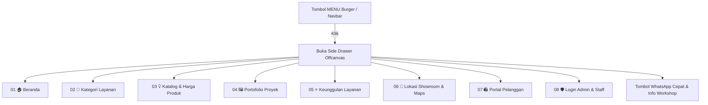
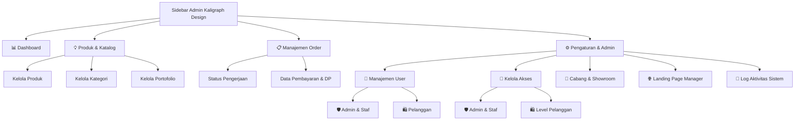
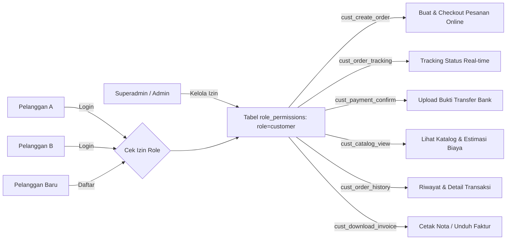
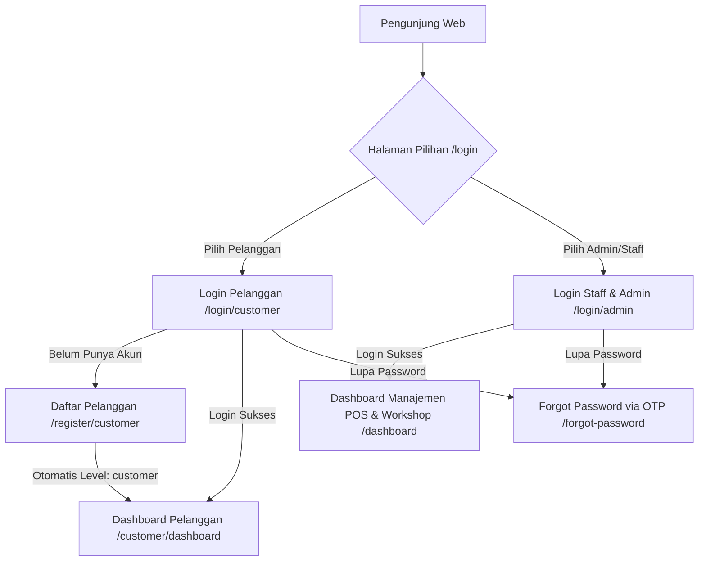
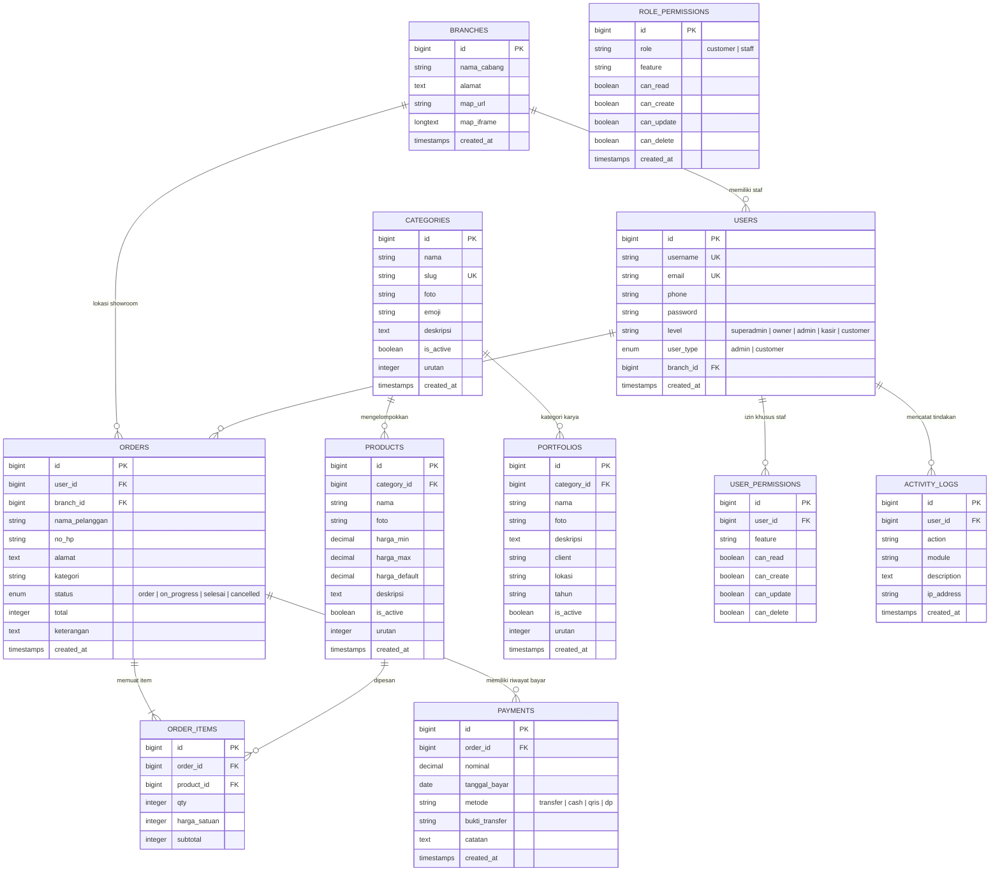

# 🎨 Kaligraph Design — Architecture & UI/UX Design System Specification

---

## 1. Filosofi & Konsep Desain

**Kaligraph Design** mengusung tema **"Electric Neon & Modern Signage Aesthetics"** dipadukan dengan **"Hero Global Style Navigation"**. 

Sistem desain ini dirancang untuk mencerminkan karakteristik industri pembuatan *neon box, huruf timbul, portofolio karya, dan signage reklame*:
* **Luminous & Vibrant**: Efek pencahayaan LED neon terang, gradasi biru elektrik (*electric blue*) ke ungu ultraviolet (*indigo/violet*), serta aksen kuning neon (*amber glow*).
* **Hero Global Style Side Drawer**: Navigasi samping offcanvas menurun ke bawah bergaya premium dengan backdrop blur, penomoran urut (01-08), hover translate halus, dan interaktivitas responsif di desktop maupun mobile.
* **Atmospheric Contrast**: Kontras tinggi antara latar belakang gelap elegan dengan elemen cahaya menyala untuk menghadirkan visual papan nama neon di malam hari.
* **Clarity & Performance**: Integrasi **jQuery DataTables** untuk pengurutan, pencarian instan, dan penomoran halaman yang ringan tanpa membebani performa browser.

---

## 2. Color Palette & Design Tokens

### Primary & Accent Colors

| Token Name | Hex Code | Preview | Penggunaan Utama |
| :--- | :--- | :---: | :--- |
| `--primary` | `#2563EB` | 🟦 | Tombol utama, link aktif, highlight teks, CTA |
| `--primary-hover` | `#1D4ED8` | 🟦 | State hover pada tombol primer |
| `--primary-light` | `#DBEAFE` | 🩵 | Background badge, icon container ringan |
| `--accent-violet` | `#7C3AED` | 🟪 | Gradient hero, icon header, portal admin |
| `--accent-neon-amber` | `#EAB308` | 🟨 | Badge "Terlaris", alert peringatan, neon glow |
| `--success-green` | `#10B981` | 🟩 | Status selesai, badge pelanggan, WhatsApp CTA |
| `--danger-red` | `#EF4444` | 🟥 | Tombol hapus, status cancelled/error |

### Neutral & Theme Palettes

```css
:root {
  /* Light Mode */
  --bg-main: #f0f4ff;
  --bg-card: #ffffff;
  --bg-sidebar: #0f172a;
  --text-main: #0d1b3e;
  --text-muted: #5a6a8a;
  --border-color: #dde4f0;
  --radius-sm: 8px;
  --radius-md: 12px;
  --radius-lg: 20px;
  --radius-xl: 24px;
}

[data-theme="dark"] {
  /* Dark Neon Mode */
  --bg-main: #060d1f;
  --bg-card: #111827;
  --bg-sidebar: #020617;
  --text-main: #f8fafc;
  --text-muted: #94a3b8;
  --border-color: #1e2d4a;
}
```

---

## 3. Sistem Tipografi

* **Primary Font Family**: `'Plus Jakarta Sans', -apple-system, BlinkMacSystemFont, 'Segoe UI', sans-serif`
* **Karakteristik**: Geometris, modern, keterbacaan tinggi di berbagai ukuran layar.

### Skala Tipografi (Type Scale)

| Level | Size | Weight | Line Height | Contoh Penggunaan |
| :--- | :--- | :--- | :--- | :--- |
| **Hero Display** | `58px` | `800 (Extra Bold)` | `1.1` | Headline Utama Landing Page |
| **Section Title** | `36px` | `800 (Extra Bold)` | `1.2` | Judul Bagian Katalog & Portofolio |
| **Card Heading** | `20px` - `24px` | `800 (Bold)` | `1.3` | Judul Kartu Produk, Proyek & Modal |
| **Body Regular** | `14px` - `15px` | `400 / 500` | `1.6` | Paragraf penjelasan & deskripsi produk |
| **Caption & Badges** | `11px` - `12px` | `700 (Bold)` | `1.4` | Badge status, kategori, nomor urut nav |

---

## 4. Arsitektur Komponen UI & Navigasi

### A. Hero Global Style Side Drawer (Navigasi Samping)
Navigasi offcanvas samping menurun ke bawah dengan interaksi micro-animation:



- **Backdrop Blur**: `rgba(15, 23, 42, 0.65)` dengan `backdrop-filter: blur(8px)`.
- **Staggered Animation**: Item menu muncul menurun dengan transisi bertahap (`transition-delay: 0.06s` hingga `0.41s`).
- **Escape Key & Outside Click**: Menutup drawer secara instan saat tombol `Esc` ditekan atau area luar diklik.

---

### B. Arsitektur Sub-Modul Admin Sidebar

Menu navigasi admin diorganisir dalam hierarki sub-menu pohon (`<ul>` dan `<li>`) yang dapat dilipat (*collapsible accordion*):



---

### C. Arsitektur Hak Akses Terpusat (Role-Based Customer Permissions)

Pengaturan hak akses pelanggan tidak memerlukan pencentangan satu per satu per pengguna, melainkan dikonfigurasi pada level **Role / Level Pelanggan** yang secara otomatis mengontrol seluruh akun pelanggan di portal:



---

### D. Dual Login Portal & Alur Autentikasi



---

## 5. Skema Relasi Database Terkini (ERD)



---

## 6. Prinsip Responsivitas & DataTables

* **DataTables Responsif**:
  - Konfigurasi default otomatis: pencarian cepat (*instant filtering*), pilihan jumlah entri (*lengthMenu: 10, 25, 50, 100, Semua*), bahasa Indonesia ramah pengguna, dan rendering pagination berbasis tombol navigasi modern.
* **Mobile-First Breakpoints**:
  - Desktop Besar (`> 1024px`): Sidebar terbuka tetap, grid 2-3 kolom.
  - Tablet (`768px - 1024px`): Grid 1-2 kolom, sidebar overlay dengan toggle.
  - Smartphone (`< 768px`): Side drawer offcanvas penuh, kartu tabel responsif horizontal scroll, touch target minimum `44px`.
* **Micro-Interactions**: Transisi halus `0.2s - 0.45s cubic-bezier(0.16, 1, 0.3, 1)` untuk semua animasi pembukaan drawer, modal, dan hover kartu.
